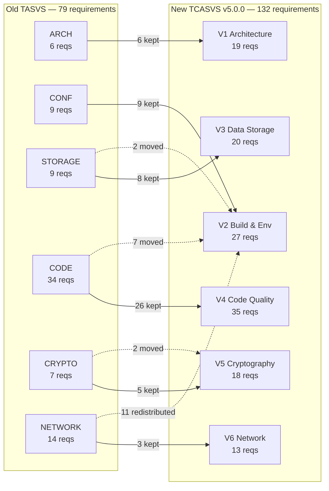

# TASVS → TCASVS v5.0.0 Migration Summary

This document summarizes the in-place restructuring of the OWASP Thick Application Security Verification Standard from its original format (TASVS) to the new ASVS 5.0.0-aligned format (TCASVS v5.0.0).

## Requirement Flow



## Key Metrics

| Metric | Value |
|--------|-------|
| Old requirements mapped | 79 (100%) |
| New requirements total | 132 |
| Gap-fill additions | 73 |
| Requirements dropped | 1 |
| Chapters completed | 6 / 6 |
| Format compliance | ASVS 5.0.0 |
| Traceability | Full ([YAML mapping](5.0/mappings/mapping_tasvs_to_tcasvs_v5.0.0.yml)) |

## Per-Chapter Breakdown

| Old Chapter | Old # | Action Summary | New Chapter | New # | Gap-Fills Added |
|-------------|:-----:|----------------|-------------|:-----:|:---------------:|
| TASVS-ARCH | 6 | 6 kept + 13 gap-fills | V1 Architecture & Threat Modeling | 19 | 13 |
| TASVS-CONF | 9 | 9 kept + 18 gap-fills | V2 Build, Deployment & Environment | 27 | 18 |
| TASVS-STORAGE | 9 | 8 kept, 2 moved to V2 + 12 gap-fills | V3 Data Storage & Protection | 20 | 12 |
| TASVS-CODE | 34 | 26 kept, 7 moved to V2, 1 dropped + 9 gap-fills | V4 Code Quality & Exploit Mitigation | 35 | 9 |
| TASVS-CRYPTO | 7 | 5 kept, 2 reorganized + 11 gap-fills | V5 Cryptography | 18 | 11 |
| TASVS-NETWORK | 14 | 3 kept, 11 moved to other chapters + 10 gap-fills | V6 Network Communication | 13 | 10 |
| **Total** | **79** | | | **132** | **73** |

## Directory Structure: Before → After

```
BEFORE (old TASVS)                    AFTER (TCASVS v5.0.0)
─────────────────────                 ────────────────────
document/                             5.0/
└── 1.0/                              ├── en/
    ├── 01-Foreword.md                │   ├── 0x00-Header.yaml
    ├── 02-Preface.md                 │   ├── 0x01-Frontispiece.md
    ├── 03-Using-TASVS.md            │   ├── 0x02-Preface.md
    ├── 04-TASVS-ARCH.md             │   ├── 0x03-Using-TCASVS.md
    ├── 05-TASVS-CONF.md             │   ├── 0x10-V1-Architecture-and-Threat-Modeling.md
    ├── 06-TASVS-CODE.md             │   ├── 0x11-V2-Build-Deployment-and-Environment-Hardening.md
    ├── 07-TASVS-CRYPTO.md           │   ├── 0x12-V3-Data-Storage-and-Protection.md
    ├── 08-TASVS-NETWORK.md          │   ├── 0x13-V4-Code-Quality-and-Exploit-Mitigation.md
    └── 09-TASVS-STORAGE.md          │   ├── 0x14-V5-Cryptography.md
                                      │   ├── 0x15-V6-Network-Communication.md
(no appendices, no tooling,           │   ├── 0x90-Appendix-A_Glossary.md
 no build pipeline, no mappings)      │   ├── 0x91-Appendix-B_References.md
                                      │   └── 0x92-Appendix-C_Contributors.md
                                      ├── mappings/
                                      │   └── mapping_tasvs_to_tcasvs_v5.0.0.yml
                                      ├── tools/
                                      │   ├── tcasvs.py
                                      │   ├── export.py
                                      │   ├── cyclonedx.py
                                      │   └── install_deps.sh
                                      ├── templates/
                                      │   ├── eisvogel.tex
                                      │   ├── header-eisvogel.tex
                                      │   └── reference.docx
                                      ├── Makefile
                                      └── generate-all.sh
                                      archive/
                                      └── 1.0-original-tasvs/   ← old content preserved
```

## Tooling & CI Delivered

| Artifact | Purpose |
|----------|---------|
| `5.0/tools/tcasvs.py` | Parse chapters, validate format, extract requirements |
| `5.0/tools/export.py` | Export to JSON and CSV |
| `5.0/tools/cyclonedx.py` | Generate CycloneDX BOM for compliance tooling |
| `5.0/Makefile` + `generate-all.sh` | Multi-format document generation (PDF, DOCX, JSON, CSV) |
| `.github/workflows/main.yml` | CI pipeline: lint, parse, export on every push |
| `5.0/mappings/mapping_tasvs_to_tcasvs_v5.0.0.yml` | Full old-to-new ID traceability (142 entries) |

## What Happens Next

1. Review this branch (`restructure/v5-format`)
2. Merge to `main` after approval
3. Run a markdown lint pass on chapter files
4. Rename the GitHub repository to `TCASVS` (in-repo references already updated to the new slug)
5. Announce the v5.0.0 restructuring to the OWASP community
